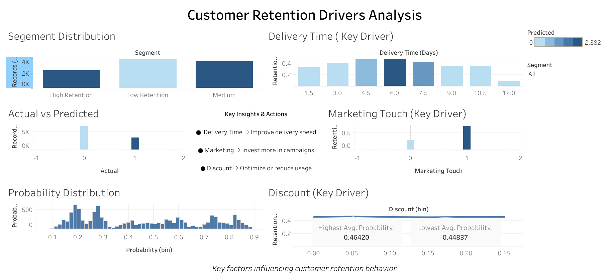

# Customer Retention Drivers Analysis (Python + Tableau)

## 📌 Business Context
Revenue growth alone does not guarantee sustainable performance.  
This project explores why customer retention varies by identifying the key factors influencing repeat behavior.

---

## 🎯 Objective
To analyze and uncover the primary drivers of customer retention and translate them into actionable business strategies.

---

## 🛠 Approach
- Data preparation and feature exploration using Python (Pandas)
- Analysis of customer behavior patterns and key variables
- Development of an interactive dashboard using Tableau
- Focus on interpretability and business decision-making

---

## 🔍 Key Insights
- Delivery efficiency significantly impacts retention — slower delivery reduces repeat behavior  
- Marketing engagement improves customer retention probability  
- Discount levels show minimal influence compared to operational and engagement factors  

---

## 💡 Business Recommendations
- Improve delivery operations to enhance customer experience  
- Invest in targeted marketing strategies  
- Optimize discount usage rather than relying on price incentives  

---

## 📊 Dashboard
Interactive dashboard available here:  
https://public.tableau.com/views/CustomerRetentionPredictionsAnalysisProject/CustomerRetentionPredictionDashboard?:language=en-US&:sid=&:redirect=auth&:display_count=n&:origin=viz_share_link

---

## 🧰 Tools Used
- Python (Pandas)
- Tableau Public
- Data Analysis & Visualization

---

## 📂 Project Structure
---Customer Retention Analysis
    --dashboard
      -dashboard-preview.png
    --data
      -customer_retention_prediction_dashboard_data.csv
    --model
      -model.pkl
      -pipeline.pkl
    --notebook
      -customer_retention_prediction_machinelearning.ipynb
    --README.md
      -README.md 

---

## 📸 Preview

---Customer Retention Analysis
 --
## 🚀 Outcome
This project demonstrates how data analysis can move beyond reporting to support decision-making by identifying the real drivers behind customer retention.
